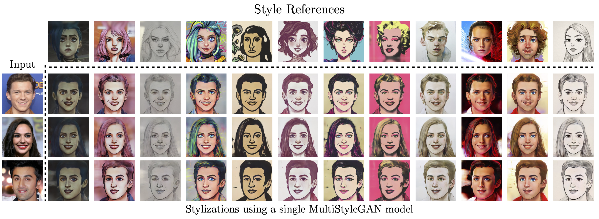

# MultiStyleGAN
[](https://arxiv.org/pdf/2210.04120.pdf)



This is the PyTorch implementation of [MultiStyleGAN: Multiple One-shot Face Stylizations using a Single GAN](https://arxiv.org/pdf/2210.04120.pdf).


>**Abstract:**<br>

Image stylization aims at applying a reference style to arbitrary input images. A common scenario is one-shot stylization, where only one example is available for each reference style. A successful recent approach for one-shot stylization is JoJoGAN, which fine-tunes a pre-trained StyleGAN2 generator on a single style reference image. However, it cannot generate multiple stylizations without fine-tuning a new model for each style separately. In this work, we present a MultiStyleGAN method that is capable of producing multiple different stylizations at once by fine-tuning a single generator. The key component of our method is a learnable Style Transformation module that takes latent codes as input and learns linear mappings to different regions of the latent space to produce distinct codes for each style, resulting in a multistyle space. Our model inherently mitigates overfitting since it is trained on multiple styles, hence improving the quality of stylizations. Our method can learn upwards of 12 image stylizations at once, bringing upto 8x improvement in training time. We support our results through user studies that indicate meaningful improvements over existing methods.

## Citation
If you use this code or ideas from our paper, please cite our paper:
```
@article{chong2021jojogan,
  title={MultiStyleGAN: Multiple One-shot Face Stylizations using a Single GAN},
  author={Shah, Viraj and Lazebnik, Svetlana},
  journal={arXiv preprint arXiv:2210.04120},
  year={2022}
}
```

## Acknowledgments
This code borrows from [JoJoGAN](https://github.com/mchong6/JoJoGAN), [StyleGAN2 by rosalinity](https://github.com/rosinality/stylegan2-pytorch), [e4e](https://github.com/omertov/encoder4editing).
